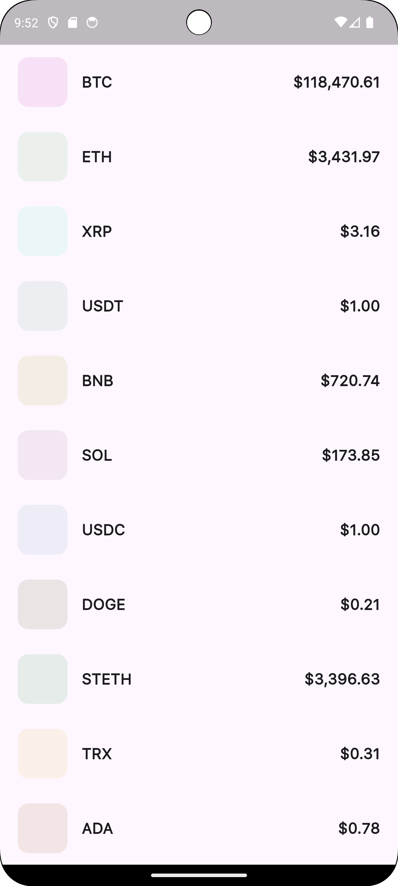

# List Assets
A simple application for viewing cryptocurrency rates

Built with Flutter

## Technologies Used
- flutter_bloc (state management)
- dio (HTTP requests)
- retrofit (API client generation)
- intl (internationalization)
- json_annotation (JSON serialization)
- equatable (object comparison)
- get_it (dependency injection)

## Features
- Infinite data loading
- Dynamic color scheme
- Price formatting
- Responsive design

***
# List Assets

Простое приложение для просмотра курсов криптовалют

Написано на Flutter

## Использованные технологии
- flutter_bloc (управление состоянием)
- dio (HTTP-запросы)
- retrofit (генерация API-клиента)
- intl (интернационализация)
- json_annotation (сериализация JSON)
- equatable (сравнение объектов)
- get_it (DI)

## Особенности
- Бесконечная подгрузка данных
- Динамическая цветовая схема
- Форматирование цен
- Адаптивный дизайн

